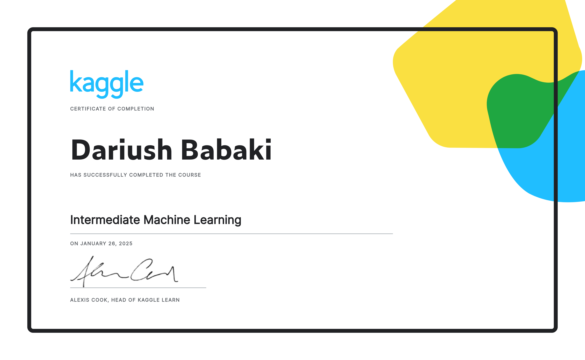

Kaggle Intro to Machine Learning — 2024 Solutions 
=====================

-   [Course Link](https://www.kaggle.com/learn/intro-to-machine-learning)

-   [My Certificate](https://www.kaggle.com/learn/certification/dariushbabaki/intro-to-machine-learning)

## Table of Contents 

1. [How Models Work](https://www.kaggle.com/dansbecker/how-models-work)   
The first step if you're new to machine learning.

2. [Basic Data Exploration](intro_to_machine_learning/02-explore-your-data.ipynb)  
Load and understand your data.

3. [Your First Machine Learning Model](intro_to_machine_learning/03-your-first-machine-learning-model.ipynb)   
Building your first model. Hurray!

4. [Model Validation](intro_to_machine_learning/04-model-validation.ipynb)  
Measure the performance of your model? so you can test and compare alternatives.

1. [Underfitting and Overfitting](intro_to_machine_learning/05-underfitting-and-overfitting.ipynb)  
Fine-tune your model for better performance.

6. [Random Forests](intro_to_machine_learning/06-random-forests.ipynb)  
Using a more sophisticated machine learning algorithm.

7. [Exercise: Machine Learning Competitions](intro_to_machine_learning/07-machine-learning-competitions.ipynb)  
Enter the world of machine learning competitions to keep improving and see your progress.

I finished this course on December 13, 2024.
The picture below shows my certificate after completing all the assignments:

